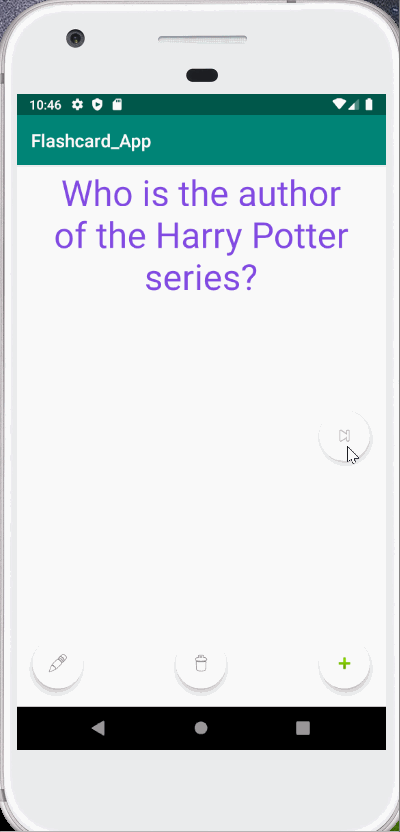
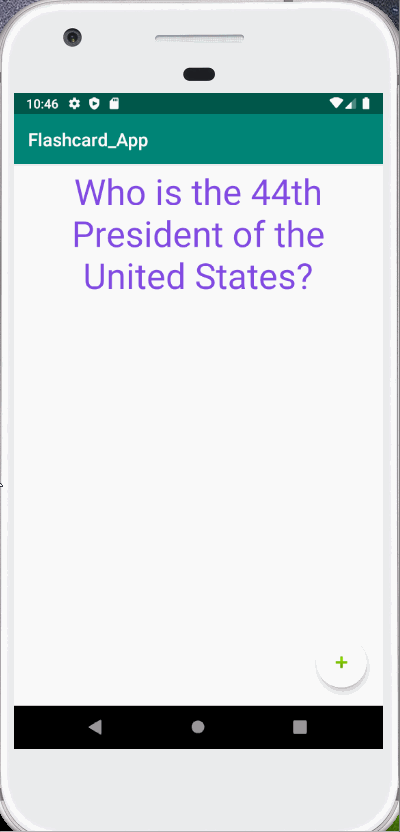
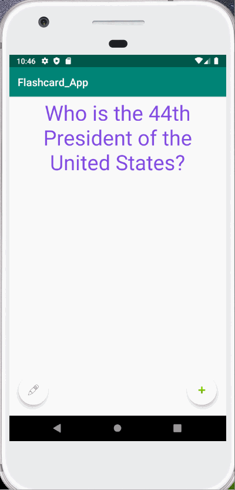
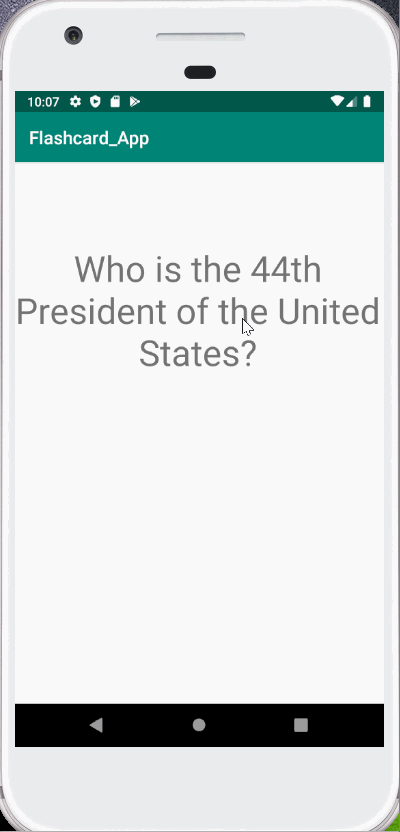
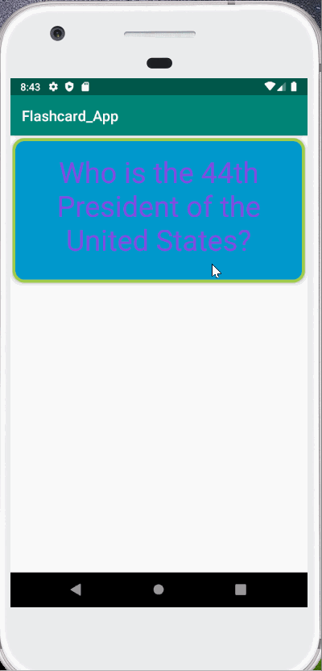
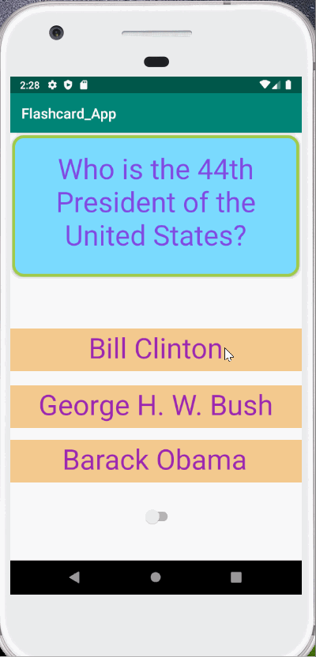

## Flashcard_App

## Lab 3

### App Description
Create Database to save the data from user input and be able to retrieve the saved data within app

### App Walk-though

 

## Required
- [x] User can create a card and still see their created card when the app is relaunched.
- [x] User can create multiple cards and browse through all created cards

## Optional
- [x] User can delete a card and no longer see it in their deck anymore
- [ ] Flashcards are shown in random order instead of the order they were created in
- [ ] User can edit a card and see the edit saved when they browse through their deck of cards
- [ ] User can create flashcards with multiple answers and be able to browse through cards with multiple choice answers shown## Lab 2

## Lab 2

### App Description
Added new features to the Flashcards App. Improved it by creating a new screen where users can create new flashcards from the app.
The new activity will allow the user to add new data to the main activity page.

### App Walk-though

 

## Required
- [x] User can click on a ‘+’ button that takes the user to new ‘Add Card Screen’
- [x] The 'Add Card Screen' has a cancel button to take the user back to the main screen
- [x] User can enter and submit a Question and Answer through the 'Add Card Screen'
- [x] User will see the card they just created on the main screen when they press the 'Save Button'
- [x] Push your progress to GitHub!

## Optional
- [x] User can edit a card
- [x] An error message is shown if the user doesn't enter both a Question and an Answer
- [x] A notification is shown if the card was created successfully

 

- [ ] User can also enter multiple choice answers when creating a card
- [ ] App is further styled and customized!

## Lab 1

### App Description
A question is prompted. Once the user clicks screen, the answer will then be prompted.

### App Walk-though

  

## Required
- [x] Create New Project in Android Studio
- [x] Add a view for the front side of the flashcard to display the question
- [x] Add a view for the back side of the flashcard to display the answer
- [x] Build in logic to show the answer side when the card is tapped
- [x] Push code to GitHub
## Optional
- [x] toggle the flashcard between the question side and the answer side
- [x] Style the question and answer side of the card to better distinguish between the two sides

  

- [x] Add selectable multiple choice answers beneath the card
   - [x] Change the background color of the multiple choice answers when clicked to indicate whether the question was answered correctly
- [x] Further customize and style the card

  
